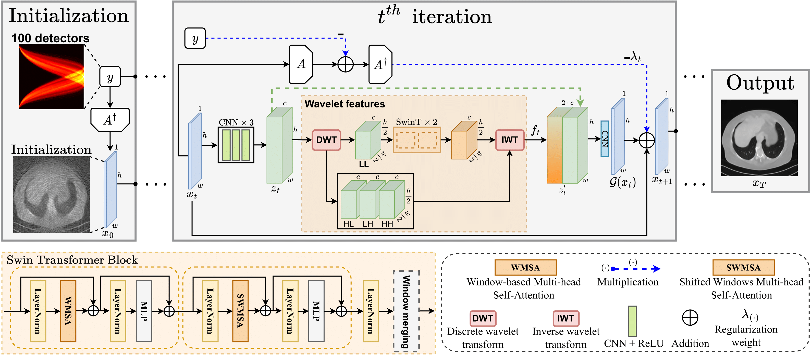

# UnWave-Net
**UnWave-Net: Unrolled Wavelet Network for Compton Tomography Image Reconstruction**

This repository contains the official PyTorch implementation of the paper _UnWave-Net: Unrolled Wavelet Network for Compton Tomography Image Reconstruction_, presented at **MICCAI 2024**.

## 🧐 Overview
UnWave-Net is designed for image reconstruction in Compton tomography, utilizing unrolled optimization techniques in combination with wavelet transforms. The model excels at reconstructing images with reduced noise by incorporating a wavelet-based regularization term.



## 💾 Dataset
The UnWave-Net model has been trained and evaluated using the [AAPM Compton Scattering Tomography Dataset](https://www.kaggle.com/datasets/ishak21/aapm-cst). This dataset is essential for benchmarking the performance of Compton tomography reconstruction techniques.

### Dataset Information
- **Source**: [Kaggle - AAPM Compton Scattering Tomography Dataset](https://www.kaggle.com/datasets/ishak21/aapm-cst)
- **Description**: The dataset consists of raw images and data obtained from Compton scattering tomography experiments. It includes data collected using different numbers of detectors, allowing for the evaluation of reconstruction performance under varying imaging conditions.
- **Download**: You can download the dataset directly from [here](https://www.kaggle.com/datasets/ishak21/aapm-cst).

## Pre-trained Models
We provide pre-trained models for UnWave-Net, trained on different datasets with and without noise. You can download these checkpoint files and use them to evaluate or fine-tune the models.

The table below lists the available checkpoints:

| Dataset   | T  | Noise  | Checkpoint Size | Download Link                                                                                   |
| --------- | -- | ------ | --------------- | ----------------------------------------------------------------------------------------------- |
| D_K = 100 | 16 | Free   | 98.2 MB         | [Download](https://drive.google.com/file/d/1CYbxA6pzSrWdhwQP02U8qVl6VqldH2Wr/view?usp=sharing)  |
| D_K = 150 | 16 | Free   | 98.2 MB         | [Download](https://drive.google.com/file/d/1WBZFehPSOu0wOuDHMejIB7rmWKHYX1_x/view?usp=sharing)  |
| D_K = 100 | 16 | With   | 98.2 MB         | [Download](https://drive.google.com/file/d/1Si1JbAJpr2EhPbpgy5OqsI6b-bXW6mF_/view?usp=sharing)  |
| D_K = 150 | 16 | With   | 98.2 MB         | [Download](https://drive.google.com/file/d/1QMANsUcuJXTms7Z2ag8tt3EfPx7Sthw1/view?usp=sharing)  |

To use these models, simply download the checkpoint files and load them using the provided evaluation scripts.

## Usage
To use the dataset with UnWave-Net, follow these steps:
#### Clone this github repo and install its requirements:
**1.** Clone this repo
```sh
git clone https://github.com/Ishak96/UnWave-Net.git
cd UnWave-Net
```
**2.** Mamba installation
If you don't have Conda installed, you can either install it manually or opt for Mamba, which is faster. 

To install Mamba, follow this link to Mambaforge. Below are the latest installers with Mamba in the base environment:

| Operating System | Architecture          | Download Link                                                                                      |
|------------------|-----------------------|---------------------------------------------------------------------------------------------------|
| Linux            | x86_64 (amd64)        | [Mambaforge-Linux-x86_64](https://github.com/conda-forge/miniforge/releases/latest/download/Mambaforge-Linux-x86_64.sh)      |
| macOS            | x86_64                | [Mambaforge-MacOSX-x86_64](https://github.com/conda-forge/miniforge/releases/latest/download/Mambaforge-MacOSX-x86_64.sh)    |
| macOS            | arm64 (Apple Silicon) | [Mambaforge-MacOSX-arm64](https://github.com/conda-forge/miniforge/releases/latest/download/Mambaforge-MacOSX-arm64.sh)      |
| Windows          | x86_64                | [Mambaforge-Windows-x86_64](https://github.com/conda-forge/miniforge/releases/latest/download/Mambaforge-Windows-x86_64.exe)  |

After installing Mambaforge, verify that it is functioning correctly by running the following command in your terminal:

```bash
mamba --version
```
**3.** Install the environment
```sh
conda env create -f env.yml
```

**4.** Activate the environment
```sh
conda activate UnWaveNet
```

**5.** Download and extract the [AAPM Compton Scattering Tomography Dataset](https://www.kaggle.com/datasets/ishak21/aapm-cst) from Kaggle.

**6.** Download the forward and adjoint operators and store them in a folder named `radon`.

The table below lists the available forward and adjoint operators:

| **D_K** | **Forward Operator** | **Adjoint Operator** |
|--------|----------------------|----------------------|
| 50     | [Download](https://drive.google.com/file/d/1pjQEAi0lAvpe9YFufcmQCFkO5ZLiamDK/view?usp=drive_link)  | [Download](https://drive.google.com/file/d/1XhQw04jFfPQGTxB-_MGwee-zAElUXuoW/view?usp=drive_link)  |
| 100    | [Download](https://drive.google.com/file/d/1erwVY1UbVJSBXJS2hSF4CMCGher72EJy/view?usp=drive_link)  | [Download](https://drive.google.com/file/d/1yOVZKcuYB9AvMBPoJWHG-oV2r8rJsRVb/view?usp=drive_link)  |
| 150    | [Download](https://drive.google.com/file/d/1Np2pYGSxaRvaVOZ-3cmJlf2EI4nvZmRN/view?usp=drive_link)  | [Download](https://drive.google.com/file/d/1Fe3KBXUxm55P8yhHb65KSgJuEAPBVet4/view?usp=drive_link)  |

**7.** Generate the JSON file containing paths to individual images / collected data:
```bash
cd util
python generate_json_cst.py --data_dir PATH-TO-CST-MAYO-DATA
```

Now you are ready to train or test UnWave-Net! 😊

##  ⏳ Training or Testing
**1. Training:**
To train the model, run the following command:
```bash
./scripts/run.sh
```

**2. Testing:**
To test the model with a specific checkpoint, use the command:
```bash
./scripts/run.sh default_hp.resume_from_checkpoint="path/to/checkpoint.ckpt" train=False test=True
```
Feel free to check the `run.sh` file and modify the arguments as needed.

## License
UnWave-Net is licensed under the MIT License. For details, please refer to the [LICENSE](LICENSE) file.

## Citation
If you find our paper useful, please cite

```bibtex
@inproceedings{ishak2024unwave,
  title={{UnWave-Net}: Unrolled Wavelet Network for {Compton Tomography} Image Reconstruction},
  author={Ishak Ayad and Cécilia Tarpau and Javier Cebeiro and Maï K. Nguyen},
  booktitle={Medical Image Computing and Computer-Assisted Intervention--MICCAI 2024},
  year={2024},
  organization={Springer}
}
```

## 👩‍⚖️ Acknowledgments and references
- This work was granted access to the HPC resources of IDRIS under the allocation 2021-[AD011012741] / 2022-[AD011013915] provided by GENCI and supported by DIM Math Innov funding.
- The dataset used in this work, the **AAPM Low-Dose CT Grand Challenge Dataset**, was provided by the American Association of Physicists in Medicine (AAPM) and is available at [AAPM Grand Challenge](https://www.aapm.org/GrandChallenge/LowDoseCT/).